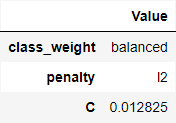
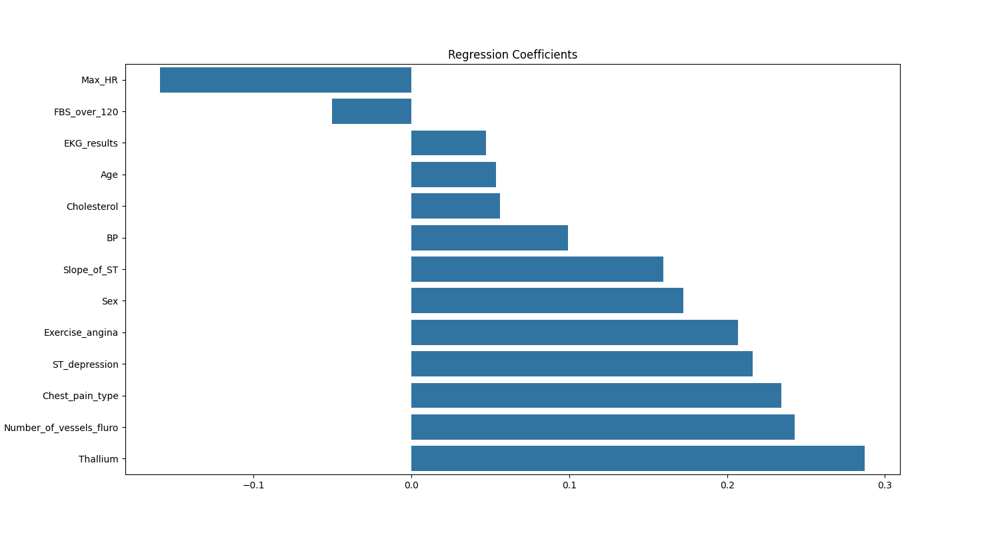

# Heart Disease Identification

This is a straightforward project that illustrates MLOps best-practices while emphasizing solution-oriented development.

Keywords: MLOps, environment reproducibility, supervised learning, binary classification, model selection, hyperparameter tuning, model inspecton, logistic regression, pipeline construction, cross-validation

### Objective

This might sound surprising to some, but medical diagnosis and treatment is mostly a game of statistics. Each person is unique, thus similar symptoms and exam resuls might be the reflection of distinct conditions depending on the subject. Since there is no single solution, different trials with different levels of complexity and invasiveness might be performed on a subject depending on their current risk of having a disease. 

In this example, we are tasked with triaging patients who could possibly have a heart disease. The objective is to **identify at least 90%** of the patients who actually have the disease while **minimizing the number of healthy patients** that are inaccurately selected.

### Dataset

The dataset used here consists of observations on 303 patients. For each patient, we have information on age, sex, intensity of chest pain, resting blood pressure, cholesterol level, whether their fasting blood sugar was above 120mg/dl, resting ECG test results, maximum heart rate, exercise induced angina and exercise induced ST depression.

The code provided here already handles every aspect of the project, including download of the aforementioned data set.

**Citation:** Janosi,Andras, Steinbrunn,William, Pfisterer,Matthias, and Detrano,Robert. (1988). Heart Disease. UCI Machine Learning Repository. https://doi.org/10.24432/C52P4X.

### Method

Since the task is a binary classification and the dataset is small, we used a Logistic Regression to predict whether the patient has a heart disease. We compared models with L1, L2, L1+L2 (elasticnet) penalties or no regularization at all, along with the necessity to weight observation based on their classes. For this comparison we used Optuna's Bayesian search, and since our goal is both to accurately identify heart disease patients and minize the rate of false-positives, we optimized for AUC.

Since logistic regressions are sensitive to absolute sizes of the features, we built a pipeline that first scales the features then fits the regression, as to avoid leakage during model selection and training.

### Results

The chosen hyperparameters, in this example, were:
- classes weighted to the inverse of their training share
- application of L2 penalty only
- inverse of regularization intensity (C) at .01

This model had an AUC of .93 on the test set. AUC is the "Area under the Receiver Operating Characteristic Curve". It basically represents the difference between the correct identification of ill patients and the incorrect signaling of disease on healthy patients across possible cutoffs for the event class probability predicted by our model.

The selection of the probability cutoff is then aligned with the business goal of identifying at least 90% of the truly diseased patients with our triage. In other words, the recall of truly diseased patients must be 90%. This in turn leaves us with a 61% recall for healthy patients.

A more intuitive way of explaining these metrics is through a confusion matrix: for every 21 patients with heart disease, our triage would correctly identify 19. At the same time, for every 33 healthy patients, we would wrongfully send 13 to the next stage of the diagnosis process even though the had no disease.

### Interpretation

Logistic regressions are known for bein highly explainable. Each feature has a single coefficient attached to it, and the bigger its absolute value the greater its influence on the prediction.

Interpreting the model is important since it might reveal surprising or counterintutive patterns that were not expected to arise, which could indicate that preconceived notions were flawed or, as in most cases, that the model is still not generalizing accurately. 

In our case, the interpretation is quite intuitive. For example:
- An elevated maximum heart rate (Max_HR) decreases the chance of heart disease
- A strong chest pain (Chest_pain_type) increases the chance of heart disease.

### Conclusion

The model meets the business objective of identifying at least 90% of the patients with the disease during the triage while not allowing too many healthy people through, and its working mechanisms are aligned with what we would intuitivelly expect when trying to identify heart disease. It is serialized and ready for consumption in a productive environment.

### Reproducibility

The environment was built using Poetry. By cloning this repository, installing packages and dependencies according to the provided .toml file and running the main.py script from within the app directory while the virtual environment is activated, you can recreate every file of the data/, models/ and reports/ folders.